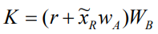

# Public Verifiable Signcryption

## 原文

[A Directly Public Verifiable Signcryption Scheme based on Elliptic Curves](./A%20Directly%20Public%20Verifiable%20Signcryption%20Scheme%20based%20on%20Elliptic%20Curves.pdf) 

## 初始化

一个椭圆曲线 G

|          | Alice         | Bob           |
| -------- | ------------- | ------------- |
| 私钥     | w_A           | w_B           |
| 公钥     | W_A = w_A * G | W_B = w_B * G |
| 身份标识 | ID_A          | ID_B          |
| 证书     | Cert_A        | Cert_B        |

私钥 w ∈ [1, n-1]，n > 2^160，即 n 至少 160 bits

## Alice -> Bob 签名

签名过程分以下几个步骤

1. 检查 Bob 的证书和公钥：**Cert_B**，**W_B**
2. 选择一个随机数 **r**，r ∈ [1, n-1]
3. 计算该随机数 **r** 在椭圆曲线 **G** 上对应的公钥 **R**，写成坐标形式 **(x_R, y_R)**
4.  
    + f 为 n 的 bit length，f / 2 为一半的 bit length，如果在 **x_R** 左侧填充 0 直到 **x_R** 和 **n** 的二进制串等
    + **x_R mod 2 ^ [f / 2]** 就是 **x_R** 二进制串的后半段；加上 **2 ^ [f / 2]** 意味着在左边加一个 **1**
    + 即得到一个这样的二进制串 **`1 [x_R的后半段]`** 记为 **x_RR**，对应论文中的 
    + 计算 **K** = (r + x_RR * w_A) * W_B，写成坐标形式 **(x_K**, y_K)
5.  
    + 选择一个 `one-way 哈希函数 H`，计算 **k** =  H ( x_K || ID_A || y_K || ID_B )
6. 选择一个 `对称加密算法 E`，以上一步得到的 **k** 为密钥，加密消息 **M** 得到密文 **C** = E ( k, M )
7. 计算哈希  **t** =  H ( C || x_R || ID_A || y_R || ID_B )
8. 计算签名 **s** = t * w_A - r (mod n)
9. 发送 **R, C, s**

## Bob 验证

以下几个步骤：

1. 检查 Alice 的证书和公钥：**Cert_A**，**W_A**
2.  
    + 计算 **K** = (R + x_RR * W_A) * w_B，写成坐标形式 **(x_K**, y_K)
3.  
    + 计算解密密钥  **k** =  H ( x_K || ID_A || y_K || ID_B )
4. 用密钥 k 去解密密文 **C** 得到原文 **M**
5. 计算哈希  **t** =  H ( C || x_R || ID_A || y_R || ID_B )
6. 判断 **s * G + R** 是否等于 **t * W_A**

## 原理

| 签名                                                         | 验证                                                         |
| ------------------------------------------------------------ | ------------------------------------------------------------ |
|  |  |

签名和验证过程中的两个 K 是相等的 

由于双方已知的信息不同，在计算 K 的时候，一方把 G 放在括号里面计算，另一方放在外面计算

## 实现

跳过验证证书和公钥这一步骤

选择

+ 椭圆曲线：Secp256k1
+ 哈希函数：keccak256
+ 对称加密算法：【暂未找到 Solidity 实现】，使用 **xor**

